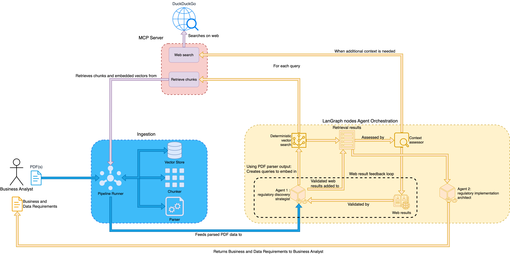
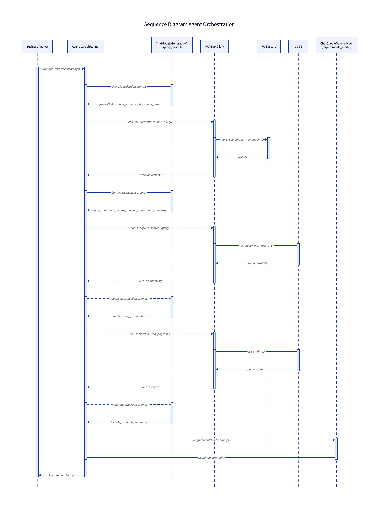

# ING-AgenticAI

> Intelligent regulatory compliance through agentic AI.
>
> Convert dense regulatory documents into traceable business and technical requirements using multi‑agent retrieval, open‑web enrichment, and structured reporting.

[](LICENSE)
[](https://www.python.org/downloads/)
[](docker-compose.local.yml)



## Overview

ING-AgenticAI is an open‑source system for regulatory intelligence. It takes portfolios of regulations, directives, and guidance and produces a consolidated requirements bundle with citations and a full decision trail. The focus is practical: convert legal text into implementable obligations while preserving evidence and traceability.

## The problem

Regulatory compliance teams face a recurring bottleneck:

- Long, complex regulatory documents with interdependent requirements
- Manual interpretation and translation into business and technical actions
- Fragmented sources, slow updates, and limited auditability

This process is slow, expensive, and error‑prone. Missing a single obligation can lead to significant compliance risk.

## How we address it

ING-AgenticAI automates regulatory analysis with a multi‑agent RAG pipeline:

- Agentic reasoning for document understanding and requirement synthesis
- Semantic retrieval over ingested PDFs with Milvus and SentenceTransformers
- Open‑web enrichment behind a controlled MCP boundary
- Full audit logging of every retrieval, decision, and source used
- Structured outputs designed for both machines (JSON) and stakeholders (PDF)

## Architecture at a glance

The system is composed of five core parts:

1. Ingestion pipeline: parse PDFs, chunk content, embed, and persist vectors.
2. MCP tool server: secure boundary for retrieval and web tools.
3. LangGraph orchestration: multi‑agent pipeline across discovery, context assessment, and requirements generation.
4. Decision logging: JSONL event stream for complete traceability.
5. Orchestration runner: portfolio‑level execution and report generation.

## How the pipeline works

The end‑to‑end workflow is purpose‑built for regulatory text:

- Query agent analyzes structure and produces targeted retrieval queries.
- Retrieval node performs deterministic vector search with de‑duplication.
- Context assessor determines gaps and triggers controlled enrichment.
- Requirements agent synthesizes obligations into structured bundles with citations.

## The agents

<p>The system uses three specialized agents with explicit inputs and outputs. Each agent operates on a structured state object and emits a typed result that is logged for traceability.</p>
<ul>
	<li>Regulatory discovery agent: consumes grouped document text and extracted headings, classifies the document type, produces a concise summary, and emits a small set of retrieval queries optimized for vector search.</li>
	<li>Context assessment agent: evaluates retrieval results for coverage, identifies missing information, and produces a list of follow‑up queries that may trigger controlled web enrichment.</li>
	<li>Requirements synthesis agent: merges document summaries, retrieval chunks, and approved web context into a structured requirements bundle with business/data requirements, rationale text, assumptions, and citation links to chunk IDs or URLs.</li>
</ul>

<table>
	<tr>
		<td width="45%">
			
		</td>
		<td>
			<p>Agents are stateless between steps. There is no shared conversation memory; the only inputs are the explicit state fields passed through the workflow. This keeps reasoning reproducible and supports audit‑grade traceability.</p>
		</td>
	</tr>
</table>

### Open‑web enrichment (controlled)

When gaps are detected, the system follows a strict triage:

1. Metadata search (DuckDuckGo snippets only).
2. Candidate screening with rationale.
3. Selective fetching through MCP with boilerplate removal.
4. Content vetting to ensure concrete, relevant obligations.

Only approved sources are added to the context, and every decision is logged.

## Outputs

- Machine‑readable JSON requirements bundle with citations
- Business‑ready PDF summary
- Full decision log in JSONL for audit and replay

## Key capabilities

- Portfolio‑level aggregation across multiple documents
- Deterministic retrieval with chunk‑level citations
- Traceable reasoning with a complete event trail
- Configurable persistence for vector stores and reports

## Architecture diagrams

- `documentation/Architecture.d2` -> `documentation/Architecture.png`
- `documentation/BusinessFlow.d2` -> `documentation/BusinessFlow.png`
- `documentation/SystemSequenceAgents.d2` -> `documentation/SystemSequenceAgents.png`
- `documentation/UseCase.d2` -> `documentation/UseCase.png`
- `documentation/Architecture.drawio` -> `documentation/Architecture.drawio.png`

## Quick start (Docker Compose)

1. Configure environment

	```bash
	cp .env.example .env
	export GEMINI_API_KEY="<your_gemini_key>"
	```

2. Start the stack

	```bash
	docker compose -f docker-compose.local.yml up --build
	```

3. Use the UI + API

	- Frontend: `http://localhost:3000`
	- Backend health: `http://localhost:8000`
	- Generate requirements: `POST http://localhost:8000/api/pipeline`

## Local run (CLI)

1. Install dependencies

	```bash
	pip install -e .
	```

2. Configure environment

	```bash
	cp .env.example .env  # if you keep one
	export GEMINI_API_KEY="<your_gemini_key>"
	```

	The same key is forwarded to `GOOGLE_API_KEY` for the LangChain Gemini client. Optionally set `VECTOR_STORE_DIR` if you want a custom persistence folder.

3. Run the pipeline

	```bash
	python -m AgenticAI.agentic.pipeline_runner --data-dir data --vector-dir artifacts/vector_store
	```

	The runner will:
	- rebuild the Milvus collection (unless it already exists and `--rebuild-store` is omitted),
	- start the MCP regulation server automatically,
	- execute the LangGraph pipeline per document,
	- persist the JSON requirements bundle to `artifacts/requirements.json` and a formatted PDF to `artifacts/requirements.pdf` (configurable via `--pdf-output`).

4. Inspect results

	Open `artifacts/requirements.json` (machine readable) or `artifacts/requirements.pdf` (business friendly) to review requirements with citations to document chunks and web sources.


## Useful CLI flags

- `--rebuild-store` – force ingestion even if a vector store already exists.
- `--top-k` – number of chunks fetched per query (default 15).
- `--server-script` – run a custom MCP server implementation if needed.
- `--output` – change the output JSON path.
- `--pdf-output` – change where the PDF rendering is stored (default `artifacts/requirements.pdf`).

## Project layout

- `AgenticAI/pipeline/ingestion.py` – ingestion and Milvus persistence helpers.
- `AgenticAI/mcp_servers/regulation_server.py` – FastMCP server exposing retrieval, metadata search, and fetch tools.
- `AgenticAI/mcp/client.py` – lightweight stdio MCP client for the LangGraph runner.
- `AgenticAI/agentic/*` – document grouping utilities, Pydantic schemas, and LangGraph orchestration.
- `AgenticAI/agentic/pipeline_runner.py` – main entrypoint that ties everything together.
- `visualizer/index.html` – UI for browsing requirement bundles and cited sources.

## License

MIT. See [LICENSE](LICENSE).
